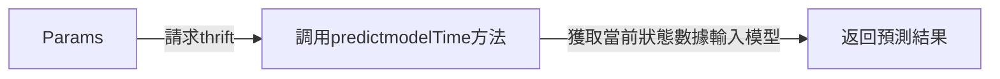
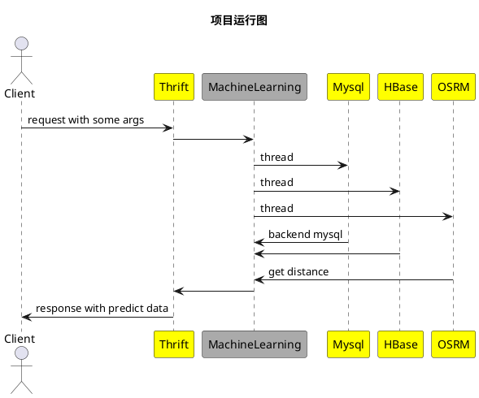
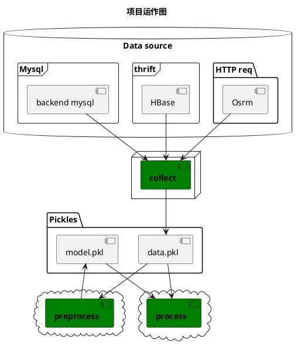

Machine Learning
================
[]() []()

本项目为机器学习项目，
## 项目算法
目前项目使用算法为xgboost，并内嵌LightGBM，AdaBoost，gradient_boost，decision_tree（决策树），random_forest（随机森林），
K（K近邻），logistic（逻辑回归），SVR（支持向量回归）等多种算法，可适应监督性机器学习(回归与分类)场景应用。

## 技术栈：
开发语言：Python
数据库：Hbase，Mysql，Redis
RPC：Thrift

## thrift 接口调用


### 参数说明
截止本文档更新，目前活跃接口有：
```
 
PredictionResult predictTime(1: list<Params> queries) \
 
```
#### Params{Model}

1、optional map<string,string> extra_data;\
2、optional list<string> extra_keys;\
3、optional bool test_mode; // 非测试唔用

|   輸入参数   |  说明                                                                       |
| ------------ | -------------------------------------------------------------------------------- |
|  extra_data  | 附加属性请调用该参数，除已规定的必要参数外，若因需求需要，须调用该参数传入特定属性。(请参考以下各模型对该参数的一些说明) |
|  extra_keys  | 若需要在respond返回某些属性值，请调用该参数，在PredictionResult中Data的extra_data中将会放回该参数的对应值。|

#### extra_data

```
predictQuoteTime :
    extra_data: Map(
        "box_size": "UNKNIWN", 
        "order_value": "209", 
        "product": "FDP-LONG"
)
```

#### PredictionResult结构说明：

1: string request_id; \
2: int error; \
3: optional string err_msg;\
4: list<Data> data

|     参数     |  说明                                                                            |
| ------------ | -------------------------------------------------------------------------------- |
|  request_id  | 访问uuid，每个请求都会携带一个id号，用以查找请求对应内部的算法运行情况，以方便排除相关问题。|
|    error     | error号，正常访问为0，有关其他报错信息代号，请参考项目内部文档。|
|   err_msg    | error对应的提示消息，只有在报错情况下才会显示该参数。|
|    data      | 请求结果结构体，具体参照以下Data说明。|

#### Data 结构说明：
1: double result;\
2: map<string,string> extra_data; // 该值可容纳其他需求值\
3: optional map<string,string> features;\

|     参数     |  说明                                                                            |
| ------------ | -------------------------------------------------------------------------------- |
|    result    | 请求返回的时间结果（秒级）。|
|  extra_data  | 请求参数Param中输入的extra_keys对应参数的值。(Accept model会自动返回shortest，longest，area—id)|
|   features   | 请求参数param中若调用了test_mode为true，将返回模型有关参数值。（用于测试，生产环境禁用）|

 -----------
 

项目有三个 _Dockerfiles_ 分别是:

1. _Dockerfile_ located in base/ folder  
    基础镜像，安装thrift和python依赖，生成 _kinming_eta_base_ 镜像
2. _Dockerfile_ located in xgb/ folder  
    依靠基础镜像安装xgboost，生成 _kinming_eta_xgb_ 镜像
3. _Dockerfile_ located in root-folder  
    功能镜像 _kinming_eta_ ，用于生成task容器，和thrift容器

You can either use the above Dockerfiles to create two base images as followed (commands run at root-folder):

    docker build -f Docker/base/Dockerfile --tag kinming_eta_base . 
    docker build -f Docker/xgb/Dockerfile --tag kinming_eta_xgb . 
    docker build --tag kinming_eta -f Docker/Dockerfile . 


## 提供thrift端口地址信息

```shell
Release: -e 47.56.204.88 -p 9090
rc: -e 47.56.90.144 -p 19090
sg-release: -e ap2-eta.ks-it.co -p 9090
```

## 项目相关命令释放

```shell
补充数据命令（适用于新增特征，特征处理逻辑未依赖于其他已处理特征） \
python collect.py -u True -f collect_topic -m time -p dataPickle
```
---------------


